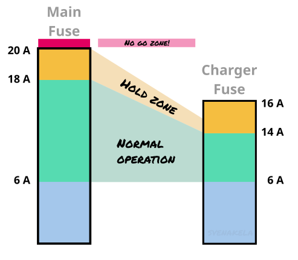
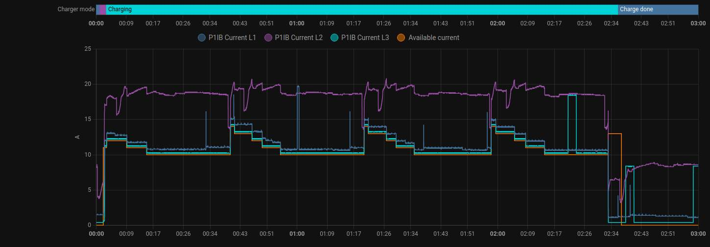
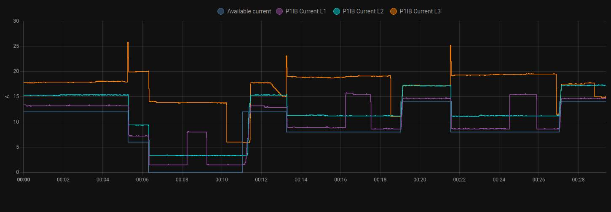
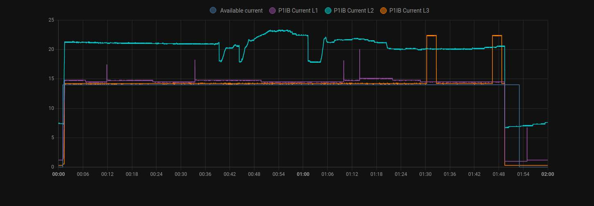

# Zaptec Load Balancing

This is a [Home Assistant blueprint](https://www.home-assistant.io/docs/automation/using_blueprints/) for 3-phase load balancing a Zaptec charger via the 
[Zaptec integration](https://github.com/custom-components/zaptec) and a smart power meter (P1/HAN meter).

Let's say you have a charger for your electric car, and want to maximise the output (or, minimise the charge time). When something else is powered up in the household, like a water heater or the stove, you risk blowing your main fuses. What a load balancer does in this situation is lowering the charger's allowed power to ease the load on the fuses.

There are many chargers with a load balancer already included in the installation. But with Home Assistant and a smart meter your charger can be controlled totally by you and the load balancing can be fine adjusted.

## How Does it Work?

The automation is constantly checking the state of the charger. As soon as the charger is requested to initialise a charging session the charger's limits are set as high as possible without risking to overload fuses.

The smart meter is constantly monitored and if the current draw for any of the three phases has changed to a higher level than accepted, the charger is adjusted to decrease the main fuse load. This adjustment can happen all the time. This is a "panic" adjustment and the charger will always be lowered if needed.

Once the main fuses have available room to increase the charging limits, the charger will again be adjusted up to higher levels. Please note that while panic adjustments can happen all the time, regular adjustments up and down occurs only within longer intervals. Neither your vehicle nor the Zaptec APIs like too frequent updates.

If the charger can't stay above 6 A charging current, the sessions will be halted. This is according charging standards. 6 A is considered minimum out for charging.  The session will be restarted when possible.

Note: A 3-phase charger is _not_ capable of consuming different levels on the three phases. If one phase is overloaded all three must be lowered. Even if the vehicle use three phases, there is only one communication pin with one signal only between the charger and the car. This is also according to the charging standard. And no, a charger of brand x, y or z is not different in this case.

## Requirements

- You need a Zaptec charger

- You need the [Zaptec integration](https://github.com/custom-components/zaptec), minimum version 0.7.0

- You need a P1/HAN meter connected to your home assistant. Minimum pushing current (A) for each phase
  - Tested devices from [Remne](https://remne.tech/) and [Smart Gateways](https://smartgateways.nl/en/product/smart-meter-wifi-gateway/)

## Installation

Copy the URL to the [charger-balancing-blueprint.yaml](https://github.com/svenakela/ha/blob/main/zaptec/charger-balancing-blueprint.yaml) file.

Go to the _Settings -> Automations & scenes -> Blueprints_ tab in your Home Assistant, click the _Import Blueprint_ button and paste the URL.

When imported you can now create an automation by clicking the imported Blueprint with the name _Zaptec EV Charger Balancing_.

## Configuration

### Main Fuse Limit

`DEFAULT VALUE: 20 A`

The main central fuses max value. These are the fuses that will be monitored by your HAN meter.

**NEVER set this value higher than your main fuses**

### Charger Fuse Limit

`DEFAULT VALUE: 16 A`

The charger has its own set of fuses and they are always of a lower value than the main fuse. Set this value to the charger's fuse limits. 

**NEVER set this value higher than your charger fuses!**

### Safe Buffer

`DEFAULT VALUE: 2 A`

AKA _Current Limit Safe Buffer_.

The `Safe Buffer` sets how many ampere at the top of the fuse limits where the load balancing is "on hold" for adjustments. See it as a sensitive area where load balancing should be held strict.

Current draw in a house is constantly changing and when the draw is within the safe buffer it is very easy to tip over to an over charge. While the household consumtion is within this range, the load balancing is bit extra careful.

This is an example where the household main fuse is 20 A, the charger has 16 A fuses and the `Safe Buffer` is set to default 2 A. 

If your power consumtion is very bouncy and you get frequent updates on the charge limit, set `Safe Buffer` to a `3` or even `4` to get a bigger hold zone. 
Note that even though your charger is set to 16 A, it will not go higher than 15 A. Setting the buffer to `1` will risk your charging sessions to be adjusted too often. A steady constant limit is considered better for the vehicle than a maximised but bouncy.

## Tuning

The main fuses can be bursted for a short while. Don't panic if that happens. The automation is even cool with that up to a 20 second period (it also takes a few seconds for the charger to react). If that happens too often though, or if the bursts are way over the limit, you probably have too much going on in your house grid. To decrease the risk of it happening you can lower the `Charger Fuse Limit` to a lower value than the real fuses. 

If you have the possibility to shut off big consumers while charging, that is a good thing. For example if you can charge at night and at the same time turn off the water heating, the charger can operate freely without large concurrent consumers interfering.

## Test cases

This automation has been tested rigidly with following settings:

### Charger
 - Zaptec Go 22 kW
### Fuse Combinations
 - 20 A main fuse, 16 A charger fuse
 - 25 A main fuse, 16 A charger fuse
 - 25 A main fuse, 20 A charger fuse
### Vehicles
 - Tesla Model Y
 - VW ID.5

If you are using this automation successfully with other settings, please report back!

## Examples of Charging Sessions vs Main Fuse Draw

Following three examples are sessions where the load balancing was stressed. 20/16 A fuse configured.

Step downn tests

Step down tests

Peak test

This fourth is under normal operation. 25/16 A fuse configured.

